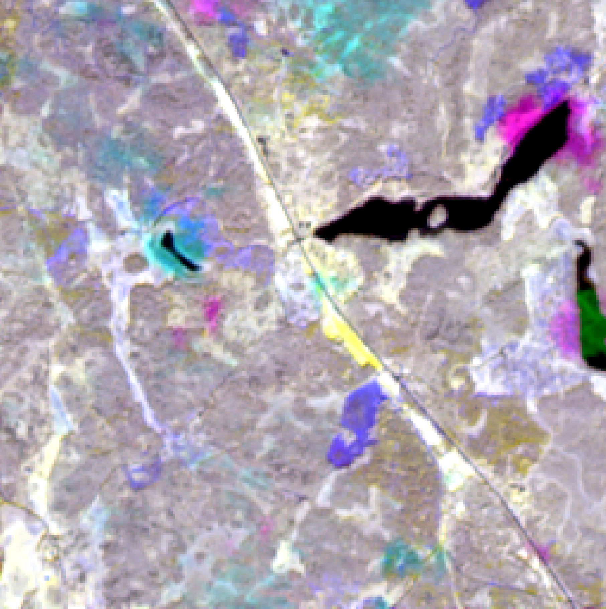
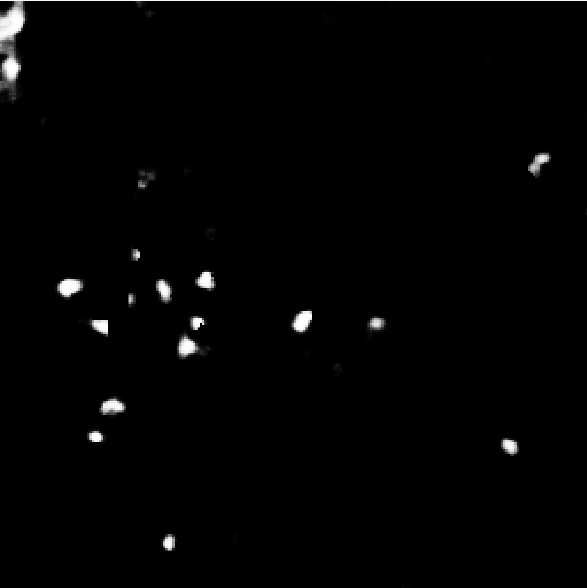

# Detecting Spruce Bark Beetle damages with Sentinel-2

## Introduction 
This software can be used to create probability maps with AI from geo-referenced tiff-files. The probability maps aims show where there are risks that trees have been infected by the spruce bark beetle.
The model is trained to detect changes between two before images (before the infection) and two after images (when there might be an infection) but other changes are detected as well.

## Prerequisites
A computer with conda installed.

## Getting Started
1. Clone the repository `git clone `

   ```
   git clone <repo url>
   ```
   or download the repository if you dont't have git.
2. Install anaconda or miniconda and create a conda environment.
   Create the conda environment with all required packages and activate the environment.
   ```
   conda env create -f environment.yml
   conda activate GBB_env
   ```
3. Go to the folder with the repo and run 
   In windows run
   ```
   ./run_inference.bat 
   ```
   and on linux run
   ```
   ./run_inference.sh 
   ```
   to execute the bundled model with one of the bundled example input images from the data-folder. This will create a file in the output folder.

## Adding your own images.
If you want to run the model on your own images the tiff-file must be structured as follows:
* NDVI,RGB,SWIR
* NDVI is one channel
* RGB and SWIR is 3 channels each 

Each of the three image types have two before and two after examples. 

Here is an example of channels in a 28 channel image:
   ```
   NDVI 2017-01-01, NVDI 2017-02-02, NDVI 2021-03-01, NVDI 2021-04-01, RGB 2017-01-01, RGB 2017-02-02, RGB 2021-03-01, RGB 2021-04-01, SWIR 2017-01-01, SWIR 2017-02-02, SWIR 2021-03-01, SWIR 2021-04-01
   ```

The input image to the model must be 28 channels according to the order above. 

###### Parameters:
--configuration: Whitch detection configuration to use.

--filename: The name of the input file to process. This file must be structured according to the specification above.

--input_channels: This should be equal to number of input channels in the training step.

--output_channels: This should be equal to number of input channels in the training step.

--ouput_path: The path where the output from the inference is written.

--weights: The path to the model weight file.

--algorithm: This should be equal to the training step.


Example command line:
```
python BatchInference.py --weights data/best_model.pth --filename data/[526560,6495000,529120,6497560].tiff --input_channels 28 --output_channels 1 --algorithm AttentionCENet  --configuration spruce_historical_damage --config_file utils/configurations.json --output_path output/
```
with the above command a tiff file should be produced in the output folder.

## Examples 
Three channels of a 28 channel input file.


The corresponting 1-channel result from the model on the above image. White indicate a possible spruce bark beetle infection.
